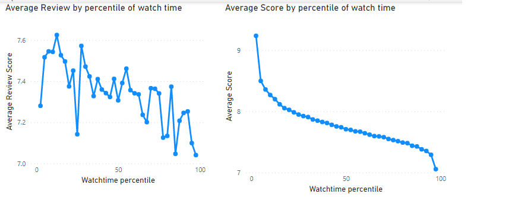
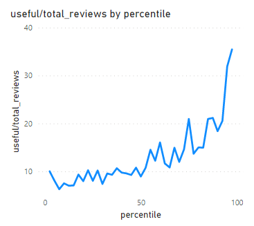
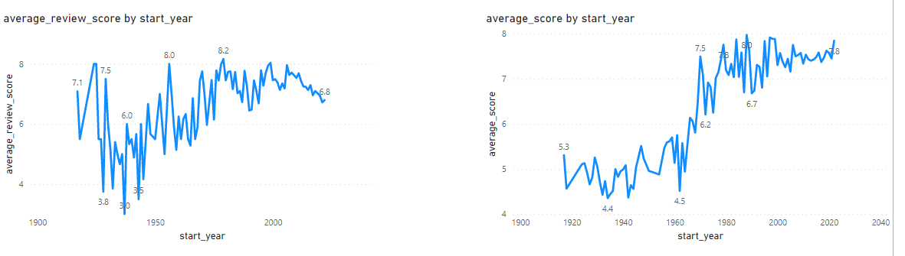

# MyAnimeList Dataset Analysis using Spark with Scala #

This is a learning project for a Big Data with Scala Spark course. It's objective is to apply an EDA (Exploratory Data
Analysis) on a dataset of free choice in order to demonstrate domain of the aforementioned tools while detecting
outliers, cleaning the data and summarize the main characteristics of the data set.

## 1. Dataset Description ##

The MyAnimeList Dataset consists in four different schemas related with each other:
This dataset contains:

* anime information for 13,379 animes
* user information for 1,123,284 myanimelist users
* 214,271 interactions between anime pairs (recommended and related animes)
* 5,048,994 interactions between user pairs (friendship)
* 223,812,614 interactions between users and animes

The different tables are stored in individual csv files except the User_Anime, which is separated in 70 individual csv
files.
The main focus of this study is the interactions between users and animes focusing in the ways they choose to rate the
animes and how the different attributes of both users and animes affect this rating.


The overview of the dataset can be found ond
the [Kaggle Dataset](https://www.kaggle.com/datasets/svanoo/myanimelist-dataset). This project uses version 2 of the
dataset.
It is also worth noting that this project is meant to run locally.

## 2. SparkSession configuration ##

The next snippet shows the configuration used for the SparkSession.
The only changed configuration is the reduction of shuffle partitions as there are not enough executors available (local
cores) to take advantage of parallelization.

```scala
  val spark = SparkSession.builder()
  .appName("App Name")
  .config("spark.master", "local")
  .config("spark.sql.shuffle.partitions", "5")
  .getOrCreate()
```

## 3. Main Questions ##

The project focuses in the solution of the following 8 questions which where proposed after analysing the data in the
latter parts of this documentation and the analysis of the different schemas.

1. What scores and reviews do users leave according their watch time?
2. What users get the most useful reviews according their anime watch time?
3. What scores and reviews do the different genres have?
4. What are the most/least reviewed genres?
5. What are the genres with most favorites?
6. What scores and reviews do users leave according the anime's age?
7. Why users decide to leave reviews?
8. How are all the kinds of reviews correlated?

## 4. Project Structure ##

In order to establish an execution order, this project structure is made. It consists on the coding stages that took
place in order to solve the main questions.

### 4.1 Helper Package ###

To avoid boilerplate the Helper package is built. It offers a series of methods for every notebook to use in the
repetitive tasks like the SparkSession builder and the reading of files.
There are two objects in this package:

1. Helper: Allows SparkSession creation and reading of files.
2. SchemaHelper: Stores the desired Schema for faster reading of the data.

### 4.2 Data Preparation ###

This part contains two notebooks:

1. Unifying Dataset: Takes the 70 raw csv files of user_anime schema and unifies them in a single parquet file for
   easier access in the next steps.
2. Cleansing Dataset: Drops useless columns from each file and saves them in a parquet file in order to optimize the
   reading process of each notebook.

### 4.3 General Analysis ###

This part analyses the most useful indicators of the data table which are later going to be used:

1. Anime:

- The majority of the animes have finished airing. Not much information can be extracted from this attribute

```
+----------------+-----+-----------------+
|          status|count|       percentage|
+----------------+-----+-----------------+
| Finished Airing|12755|95.33597428806338|
|Currently Airing|  258|1.928395246281486|
|   Not yet aired|  366|2.735630465655131|
+----------------+-----+-----------------+
```

- There are 44 different genres (top 7 on display)

```
+-------------+-----+
|        genre|count|
+-------------+-----+
|       Comedy| 5091|
|       Action| 3495|
|      Fantasy| 2785|
|    Adventure| 2379|
|        Drama| 2146|
|       Sci-Fi| 2087|
|      Romance| 1772|
+-------------+-----+
```

The most useful attributes from this tables are the genres and the dates of start and ending of the show's airing.

2. User

* A short summary of the most interesting columns is made and gives the following results:

```
+-------+------------------+------------------+------------------+------------------+
|summary|        mean_score|     num_completed|      num_watching|          num_days|
+-------+------------------+------------------+------------------+------------------+
|  count|           1123284|           1123284|           1123284|           1123284|
|   mean| 7.122094750748184|159.08479155761142|11.487242763183666| 55.73767017067854|
| stddev|2.4771154476423756| 228.7494619791284|35.294089253672325|134.43298319025172|
|    max|              10.0|             18659|             11014|          105338.6|
+-------+------------------+------------------+------------------+------------------+
```

It shows big differences in the latter attributes, where the standard deviation confirms how dispersed the behavior of
the users is. The num_days attribute can be useful as it states how much anime can a user watch.

3. UserAnime

* With this notebook it is found that nearly half of the interactions do not have scores.

```
+---------+---------+------------------+
|has_score|    count|        percentage|
+---------+---------+------------------+
|    false| 94596066|42.265743788685654|
|     true|129216548| 57.73425621131435|
+---------+---------+------------------+
```

* For the 42% (interactions without score) it is shown that besides the application not letting users score without
  having
  watched the anime, a big group of users that have completed it, simply do not leave their score.

```
+-------------+--------+------------------+
|       status|   count|        percentage|
+-------------+--------+------------------+
|     watching| 4770335| 5.042847130661861|
|    completed|27334555|28.896080097030673|
|      dropped| 3023378| 3.196092742376834|
|      on_hold| 3010012|3.1819631907314205|
|plan_to_watch|56457786| 59.68301683919921|
+-------------+--------+------------------+
```

* While the other 58% contains mainly completed interactions.

```
+---------+---------+------------------+
|   status|    count|        percentage|
+---------+---------+------------------+
|completed|122194112| 94.56537408815471|
| watching|  2330148|1.8032891576704246|
|  dropped|  3217123|2.4897143978803706|
|  on_hold|  1475165|1.1416223562944896|
+---------+---------+------------------+
```

* We can also find the average and standard deviation of both the review_score and the score.

```
+-----------------+------------------+-----------------+-----------------+
|        avg_score|         std_score| avg_review_score| std_review_score|
+-----------------+------------------+-----------------+-----------------+
|7.491251933150234|1.7448017790109245|7.287402726275657|2.348781735684145|
+-----------------+------------------+-----------------+-----------------+
```

The previous results show that there are many interactions without a score which is the main attribute of this study,
this must be taken into account when reading the dataframe avoiding those interactions without them. However, this being
a central table, possesses great potential for analysis as it can be joined with other attributes and describe the way
this groups review.

With the previous analysis and the study of the dataset schema, the main questions are set and the Next Analysis is
made.

### 4.4 Next Analysis ###

Next Analysis contains notebooks where different tables are joined in order to answer the main questions.
Some notebooks follow a similar structure in order to get information from the data about how users review while being
grouped by different attributes.
Also, some notebooks write the resulting dataframe in a single csv file for easy visualization with PowerBI in order to
answer the questions.
The following explains the notebooks in the Next_Analysis folder:

1. Age and UserAnime: This notebook creates a new dataframe from the anime table with the year in which the anime was
   released and when it ended. This table is then joined with the main dataset, User_Anime, and grouped by the year.
2. Genres and UserAnime: This notebook creates a new dataframe exploding the "genres" array of the Anime table and then
   joins it with User_Anime to be grouped by individual genre and getting insights on them.
3. UserAnime: This notebook does two main analysis. The first one, gets the correlation between the different types of
   review and shows it in a dataframe. The next one, tries to find what makes a user to give a review instead of just a
   score. To do this, the dataframe joins itself to compare how the users write reviews.
4. UserPercentile and UserAnime: This notebook assigns a percentile of the user spent time watching anime in order to
   group evenly and join them with the User_Anime dataframe and gather insights from it.

## 5 Question solving ##
The results are written in a csv file which is graphed in Power BI for readability

### 5.1 What scores and reviews do users leave according their watch time? ###
This question tries to answer how "veteran" anime users tend to rate the content.
In order to have a better distribution and easier analysis and, as mentioned above, grouping by percentile we get the following results. 



Graphing helps to see how both the review_score and score average tend to go down with more watch-time. This can be due to users being more critical of what they watch or just consuming
content with less quality. 

### 5.2 What users get the most useful reviews according their anime watch time? ###
This question tries to answer what level of user "seniority" give the valuable reviews. 
In order to get a more objective analysis, useful reviews is divided by the total reviews users have submitted and it is shown in the following graph.



The graph clearly shows how much more useful are the reviews given by their "seniority", as it continuously increases.

### 5.3 What scores and reviews do the different genres have? ###
This question tries to find the best and worst reviewed and scored animes.
This first graph shows how Award Winning and Military animes have the best ratings with moderate to low standard deviation.


The second graph, shows an even higher rating for Award Winning animes and the lowest to Erotica ones.


Both of these graphs can be biased, as it was seen in the General Analysis, none of this genres were in the top count of anime genres. 

### 5.4 What are the most/least reviewed genres? ###
Based on the previous question we go further analysing how many reviews and scores are given by genre.
It clearly shows the strong superiority of interactions with the Comedy and Action genres 


Going back to the previous question it can also be seen how the reviews and scores of the top genres are sit in the middle. 
This positions this genres as the strongest and favorites of the users.

### 5.5 What are the genres with most favorites? ###
This questions tries to support the previous statement as we can se how they are the genres with most favorites voted on all the platform.


### 5.6 What scores and reviews do users leave according the anime's age? ###
This question tries to answer if age has an effect on an anime's review and score.
The graph shows no particular preferences on the reviews but a clear preference on modern anime with the average score.  



The age of an Anime does not seem to effect on how it is reviewed but it does in how it es scored, showing tendency to prefer modern content.


### 5.7 Why users decide to leave reviews? ###

This questions focuses on finding what can be the reason for users to want to leave a review, given that the main interaction is just setting a score. To do this the average review_score and score are computed and then compared with the average score when the user does not review.
```
+-----------------+-----------------+------------------------------------------+------------------------------------------+
|   average_score |  AvgScoreWReview|AVG(average_score_WReview - average_score)|STD(average_score_WReview - average_score)|
+-----------------+-----------------+------------------------------------------+------------------------------------------+
|7.476541122294622|7.320495958899991|                      -0.15604516339462182|                        1.6220288234143447|
+-----------------+-----------------+------------------------------------------+------------------------------------------+
```
There is no significant difference at plain significant difference,
but that small difference with the standard deviation shows 
how the average score contains a slightly higher average and 
than the one given in the reviews. Indicating that users tend to leave worse scores when
they're reviewing which could tell they prefer to rate worse when they are setting a review.

### 5.8 How are all the kinds of reviews correlated? ###

This question looks for the relationship between the different aspects of the anime that can be reviewed (story, sound,
characters).
In order to solve this, the UserAnime notebooks applies the correlation function between all the combinations giving the
following result:

```+--------------------+--------------------+------------------+
|             ReviewA|             ReviewB|       Correlation|
+--------------------+--------------------+------------------+
|        review_score|               score| 0.936381896052212|
|  review_story_score|review_character_...|0.8621231722993825|
|review_character_...|review_enjoyment_...|0.8582804107642983|
|  review_story_score|review_enjoyment_...|0.8397310090961153|
|review_animation_...|  review_sound_score|0.8140139842420171|
|        review_score|review_enjoyment_...|0.7715333384891444|
|        review_score|review_character_...|0.7542874702703505|
|        review_score|  review_story_score|0.7541596517470185|
|  review_sound_score|review_character_...|0.7509668163024262|
|  review_sound_score|review_enjoyment_...|0.7479334370477032|
|               score|review_enjoyment_...|0.7414854993418932|
|  review_story_score|  review_sound_score|0.7352997456092938|
|               score|review_character_...|0.7244926082815589|
|               score|  review_story_score|0.7233285726162524|
|review_animation_...|review_enjoyment_...|0.7206944477405531|
|review_animation_...|review_character_...|0.7156321430814482|
|  review_story_score|review_animation_...|0.7041150901101043|
|        review_score|  review_sound_score|0.5614722679788601|
|               score|  review_sound_score|0.5388575717897136|
|        review_score|review_animation_...|0.5273645551088207|
|               score|review_animation_...|0.5060986893915467|
+--------------------+--------------------+------------------+
```

It is not surprising how all of them are directly correlated.
It's worth noting how the review and score have the stronger correlation but also how the story and character, and
animation and sound
are too, as it is that the score and review score posses the lowest correlation with both animation and sound. A
plausible conclusion could be how the animation and sound are tightly bounded and aisled from the
rest of rest of the aspects. Another one could be how the enjoyment of an anime relates strongly with the character and story development.

## 6 Future implementations ##

The general analysis of this dataset can achieve interesting
conclusions, however this dataset offers much more value which could
lead to stronger user understanding, anime recommendations and ML training.
Each of the showed parameters could be more thoroughly grouped and getting more specific insights from each group.

## 7 Conclusions ##
